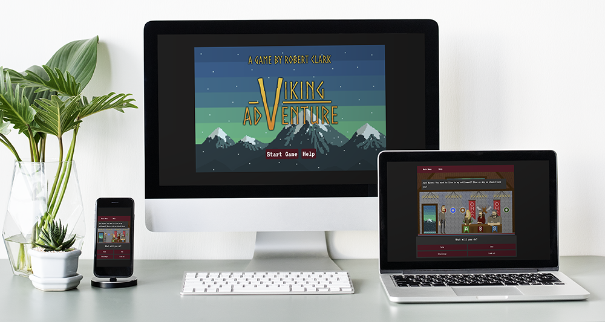
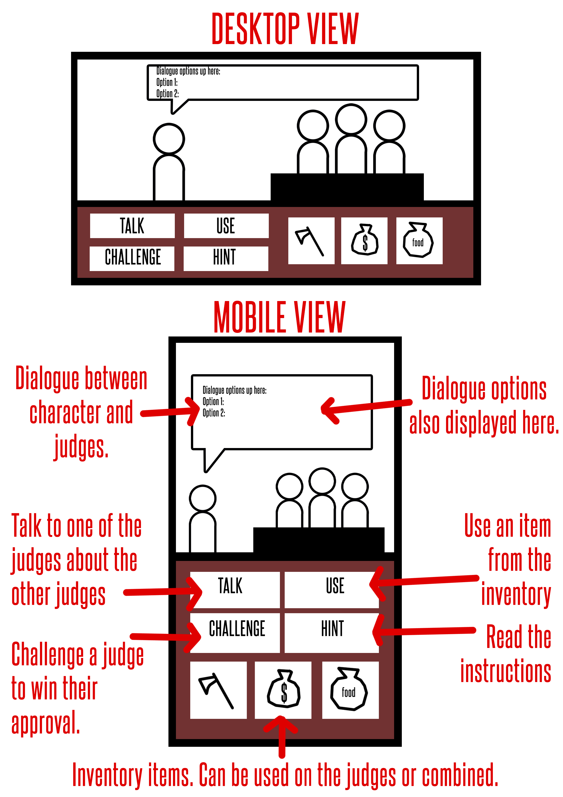
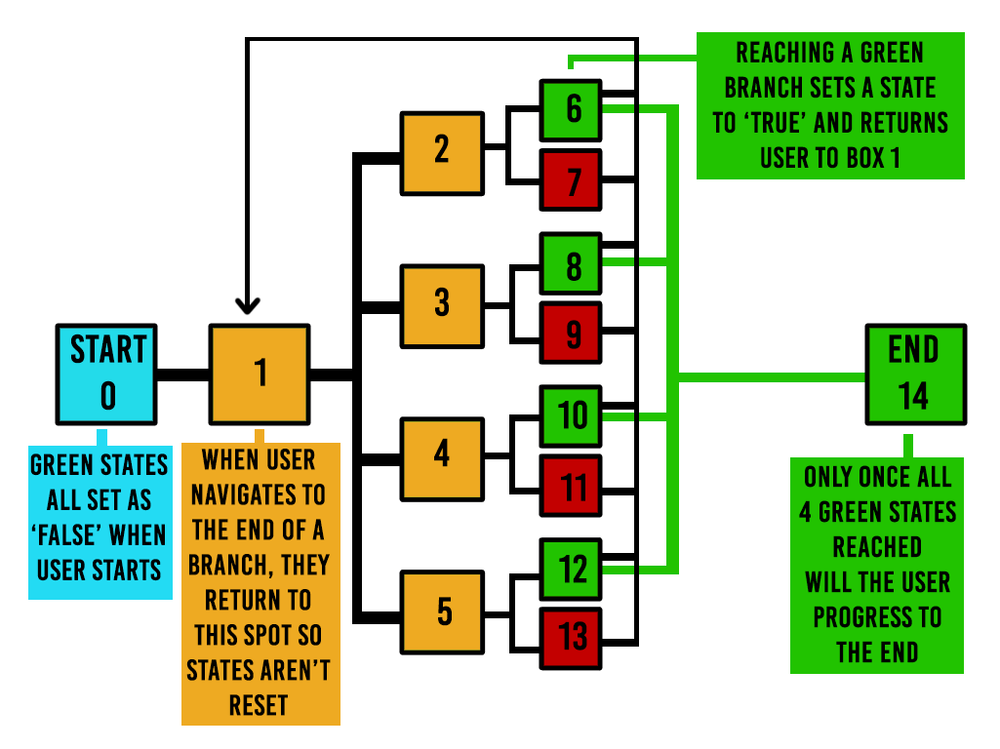
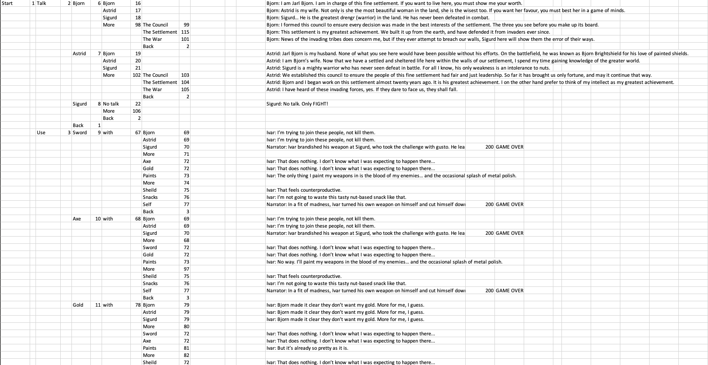
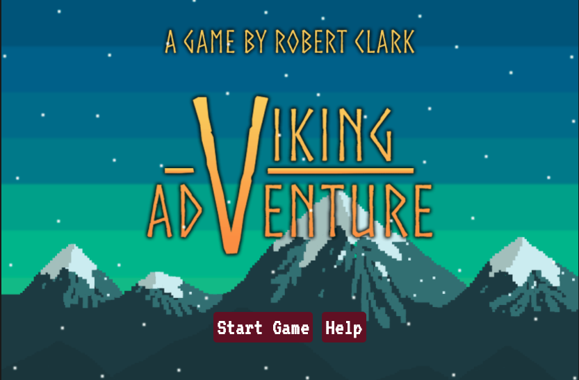
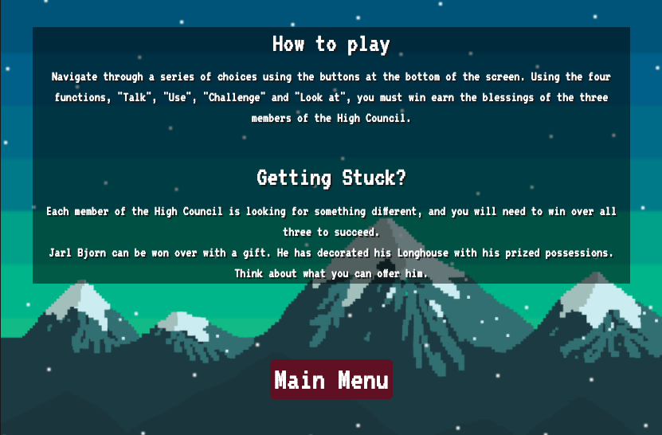
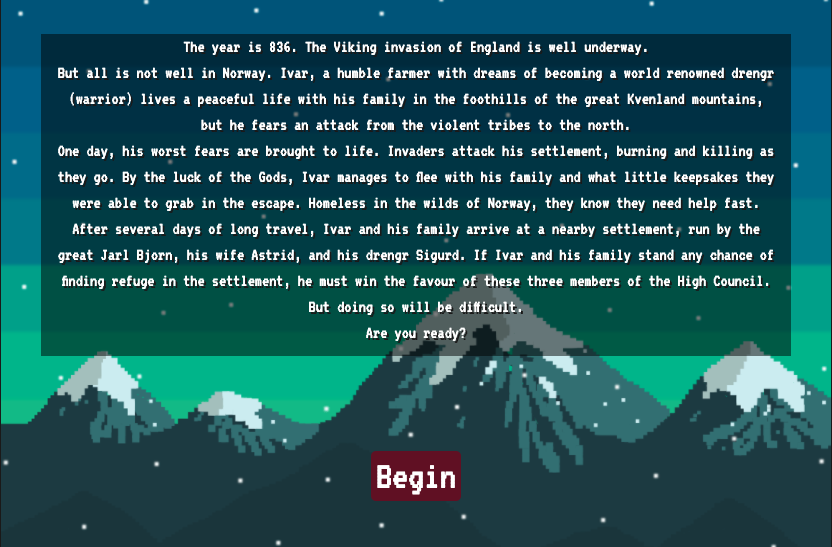
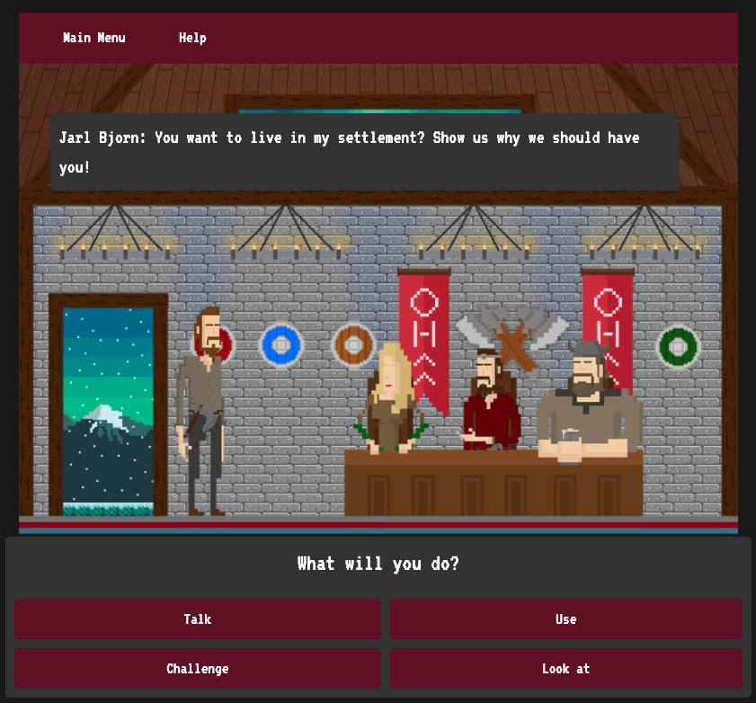

# Milestone Project 2 - Viking Adventure Game

[Viking Adventure Host Link](https://robert-clark-1990.github.io/MSP2_Viking_Adventure/)

[Viking Adventure GitHub Repo Link](https://github.com/Robert-Clark-1990/MSP2_Viking_Adventure)

# Table of Contents

* Introduction

1. User Experience (UX)
* Project Goals
* User Stories
* Design

2. Features
* Existing Features
* Future features to implement

3. Technologies Used
* Language Used
* Frameworks, Libraries & Programs Used

4. Testing
* Bug fixes
* Performance
* Validator Test
* Meeting the Game needs

5. Deployment
* Running this project from the repository
* Running this project locally

6. Credits
* Content
* Media
* Code
* Acknowledgements

---

# Introduction



Inspired by classic point and click adventure games such as the Monkey Island series, GAME NAME is a short demo of what will one day become a full length game. 
In the game, we follow Ivar, a Norse farmer with dreams of becoming a famous Viking warrior. After his farm is attacked by an invading army, he and his family are forced to relocate to a larger settlement nearby.
It is here the game begins. In order to secure a place for his family in the new settlement, Ivar must first meet with an win over the high council, made up of three important figures:
Jarl Bjørn Odensson, his wife Astrid, and his prized warrior, Sigurd.
The player will guide Ivar through a series of options, learning more about the three members of the high council, and what exactly they can do to win over each member.
As the Jarl of the settlement, Bjørn has riches beyond his wildest imaginations, so the player must use everything they have in their inventory to create something truly unique to win him over.
Astrid, a wise and wistful poet, is searching for someone to match her intellect, and so challenges Ivar to answer three riddles, each of which he must get right in order to succeed.
Sigurd, a battlehardened drengr (warrior) will only approve of someone who can beat him in battle. While Ivar has access to both a sword and an axe, facing Siguard in combat will end in failure. In order to beat this formidable foe, Ivar must think outside the box...
Only once all three members of the high council have been won over will the player be granted refuge, thus concluding the demo.

---

# User Experience (UX)

## Project Goals

As a homage to the old point and click adventure games of the nineties, this project aims to provide players with an experience reminscent of those old games. 
The art style, user interface, and puzzles will be themed around this retro style. Offering players a demonstration of what will one day become a much larger game, 
this project aims to deliver an interesting, engaging, puzzle-focused experience that will leave players searching for more.

## User Stories

As a first time player, I want to:
* Understand the premise of the game, and the object required to succeed.
* Be presented with an easily-understood user interface.
* Be able to read instructions on how the game works.
* Navigate through the various challenges presented with help from dialogue and contextual clues.
* Have a bug-free experience.

As a returning player, I want to:
* Discover my progress has been saved in local storage.
* Discover alternative dialogue choices based on using incorrect items with things.
* Be able to play the demo entirely on any screen size I desire and have the interface adapt appropriately.

## Design

### Colour Scheme
In keeping with the Point and Click asthetic, an 8-bit art style has been used throughout the game.

### Typography
The primary font used on this project is [VT323](https://fonts.google.com/specimen/VT323?preview.text=Talk%20Use%20Inventory&preview.text_type=custom&sidebar.open=true&selection.family=VT323). This was chosen to stay in keeping with the artistic style.

### Artwork
All artwork has been created by project developer, Robert Clark, with inspiration gathered from old Point and Click adventure titles akin to those of the Monkey Island series.

### Wireframes
In order to achieve the look and function of an old point and click adventure title, much thought was put into the project.



With the layout of the game established, even greater thought was required to give the user several branching narratives with plenty of choices.



In order to keep track of each narrative decision, each choice was written down in an Excel document with corresponding numbers to navigate between options. 



The PDF version of the Excel document can be found in its entirety [here.](assets/docs/Viking-Adventure-ID-Tree.pdf)

---

# Features

## Existing Features

### Home Page



Here users are greeted with an animated homepage with the game name and links to the game and a help page. 
The artistic style mimics that of the game to ensure users understand the theme before the game has begun.

### Help Page



Here users are given an understanding of what situation their protagonist is in, and what is required of them to complete the game.

### Intro Page



Here users are given a brief introduction to the game's story, and how the protagonist is in the situation they are in.


### Game Page



Here is the meat of the project. Users are introduced to the game before they are let loose to try and reach the game completion. 
Through the interactive buttons provided at the bottom of the page, users must use their inventory and conversational options to win the affection of each member of the High Council.


## Future features to implement

### Further interactivity

1. As this game uses gif-based images to present a living world, a future update will overhaul this by presenting layered content that users can navigate the character of Ivor through, interacting with things he sees both in and outside the camp.

---

# Technologies Used

### Languages Used

1. [HTML5](https://en.wikipedia.org/wiki/HTML5)

   This project uses HTML5 as it's main language.

2. [CSS3](https://en.wikipedia.org/wiki/CSS)

   This project uses CSS3 for it's styling.

3. [JavaScript](https://www.javascript.com/)

   This project uses JavaScript to operate the game functions.


### Frameworks, Libraries & Programs Used

1. [Bootstrap v4.3.1](https://getbootstrap.com/docs/5.0/getting-started/download/)

   Bootstrap was used to assist with the responsiveness and styling of the website.

2. [Google Fonts](https://fonts.google.com/specimen/VT323?preview.text=Talk%20Use%20Inventory&preview.text_type=custom&sidebar.open=true&selection.family=VT323)

   Google Fonts was used to import the "VT323" font.

3. [Git](https://git-scm.com/)

   Git was used for version control, utilising the Gitpod terminal to commit to Git and Push to GitHub.

4. [GitHub](https://github.com/)

   GitHub was used to store the project.

5. [Adobe Photoshop](https://www.photoshop.com/en)

   Adobe Photoshop was used to create the artwork used throughout the project.

6. [GifMaker](https://gifmaker.me)

   GifMaker was used to turn the artwork into animated gifs, giving the game a more interactive feeling.

---

# Testing

## Bug fixes

### In-Game Modals

There was an issue regarding the in-game modals not appearing when requested. 

```
<nav class="navbar">
            <div>
                <ul class="nav nav-fill">
                    <button type="button" data-toggle="modal" data-target="#warningModal" class="btn btn-primary">Main Menu</button>
                    <button type="button" data-toggle="modal" data-target="#helpModal" class="btn btn-primary">Help</button>
                </ul>
            </div>
        </nav>
        <div class="modal fade" id="warningModal" tabindex="-1" role="dialog" aria-labelledby="warningModalLabel" aria-hidden="true">
            <div class="modal-dialog" role="document">
                <div class="modal-content">
                    <div class="modal-header">
                        <h5 class="modal-title" id="warningModalLabel">Are you sure?</h5>
                    </div>
                    <div class="modal-body">
                        <p>If you leave the game, you will lose your current progress.</p>
                    </div>
                    <div class="modal-footer">
                        <button type="button" class="btn btn-secondary" data-dismiss="modal">Continue Game</button>
                        <button type="link" class="btn btn-primary" onclick="window.location.href='index.html'">Return to Main Menu</button>
                    </div>
                </div>
            </div>
```
Despite best efforts to retrieve a solution online, it was the Code Institute tutors who provided the solution. A missing piece of jQuery code had been excluded from the game.html file, which once added made the first modal work fine.


### Buttons

During the development of the modal, an issue arose in which the player choice buttons on the game.html page stopped displaying the various IDs shown in game.js.
As this occured immediately after the implementation of the modal and the inclusion of the jQuery file, it is here that I suspect the issue lies.
However, with every attempt to fix made, the layout is distorted wildly, and when the modal and jQuery aspects are removed, it does not restore functionality to the buttons.

After many attempted fixes, it turns out it wasn't a problem caused by the modal, but caused from adding in setState, requiredState and currentState elements to the game.js.

```
    function startGame() {
        state = {BjornPleased = false, SigurdPleased = false, AstridPleased = false, hasPaintedShield = false}
        show = showTextNode(1)
    }
```
After much research, it was discovered to be an issue relating to the Syntex Error: invalid shorthand proprty initializer, 
so the states were changed from **BjornPleased = true**, to **BjornPleased: true**, etc.

### Setting States

Throughout development, there was an ongoing issue with setting states that would be remembered after being met, such as the combination of the Paint and Shield to create the Painted Shield.
At first, using setState caused an error where the buttons stopped showing the correct text (as mentioned above) and this was fixed by setting the states when the startGame function runs initially.
However the problem persisted with the states not changing as necessary actions were performed.

```
    function showTextNode(textNodeIndex) {
        const textNode = textNodes.find(textNode => textNode.id === textNodeIndex);
        textElement.innerText = textNode.text;
        dialogueTextElement.innerText = textNode.dialogue;
        while (optionButtonsElement.firstChild) {
        optionButtonsElement.removeChild(optionButtonsElement.firstChild);
    }
  ```
  Following a conversation with one of the Code Institute tutors, it was established that a second function needed to be created similar to how the showTextNode function was used to return text from the TextNode.


### Game.html Code Error

During coding, a row div was rendered unneccessary, and blocked out while further testing was required. However, once the decision to delete it was made, it began to throw up an issue wherein the dialogue and 
choice buttons started being distorted out of shape. The code causing this can be seen below.

```
<!--<div class="row dialogue-box">
            <div class="col" id="dialogue">
                Dialogue
            </div>
        </div> --> 
```

Even though it was blocked out, it was still causing a bug when deleted. To fix it, the code was rewritten without being blocked out, then the blocked out code was deleted at the same time.
This appeared to revert the structure, so that once the new code was then deleted, it functioned as intended.

## Performance

## Validator Test

## Meeting the Game needs

As outlined in the Project and User Goals, there were 9 main things that were required of this project:

### Project Goals

1. Through the use of a retro art style, user interface, and puzzles, provide players with an experience reminscent of old point and click adventure games. 

2. To deliver an interesting, engaging, puzzle-focused experience that will leave players searching for more.

### First-time Users

1. To be able to understand the premise of the game, and the object required to succeed.

2. To be presented with an easily-understood user interface.

3. To be able to read instructions on how the game works.

4. To be able to navigate through the various challenges presented with help from dialogue and contextual clues.

5. To have a bug-free experience.

### Returning Users

1. To discover my progress has been saved in local storage.

2. To discover alternative dialogue choices based on using incorrect items with things.

3. To be able to play the demo entirely on any screen size and have the interface adapt appropriately.

---

# Deployment

## Running this project from the repository

This project was created using **Gitpod**, and pushed to **GitHub**. To deploy this page to GitHub from it's GitHub repository, the following steps were taken:

1. Visit [GitHub](https://github.com/) and log in.

2. From the repositories, select **Robert-Clark-1990/MSP2_Viking_Adventure**.

3. From the GitHub repository, click on **Settings**.

4. Scroll down to the section entitled **GitHub Pages**.

5. From the dropdown menu beneath **Source**, select the **Master branch** and hit **save**.

6. This will create a link, visible just **below the GitHub Pages title**, which will take you to the deployed website.


## Running this project locally

   To clone this project into Gitpod you will need:

1. A GitHub account.

2. Access to the Chrome browser.

   Then follow these steps:

1. Install the Gitpod Browser Extensions for Chrome and restart your browser.

2. Log into Gitpod and navigate to the Project GitHub repository.

3. Click the green **"Gitpod"** button at the top of the repository.

---

# Credits

### Content

* All story, help, and dialogue content was created by the developer, [Robert Clark](https://github.com/Robert-Clark-1990).


### Media

* All artwork and animations were created by the developer, [Robert Clark](https://github.com/Robert-Clark-1990).


### Code

* The tutorial "Build a Text Adventure Game" by [WebDevSimplified](https://github.com/WebDevSimplified/JavaScript-Text-Adventure) was used as a basic outline to build out the player choice tree.


### Acknowledgements

* Thanks to [WebDevSimplified](https://www.youtube.com/channel/UCFbNIlppjAuEX4znoulh0Cw) for his Text Adventure video.

* Thanks to [Ron Gilbert](https://grumpygamer.com/) for creating the Monkey Island series, which inspired this project in the first place.

* Thanks to the amazing tutors at [Code Institute](https://codeinstitute.net/) who offered support and advice through the project's more frustrating sections.
